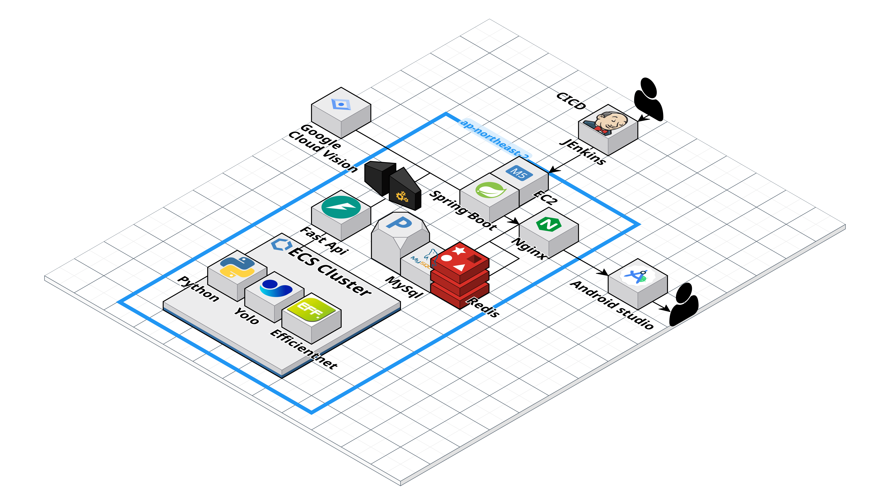

# 🚀 LooKey - AI 기반 편의점 상품 인식 및 추천 서비스

<div align="center">
  <h3>눈을 감아도 편의점 세상을 보여주는 루키</h3>
</div>

---

## 📋 목차

1. [ 프로젝트 소개](#-프로젝트-소개)
2. [ 주요 기능](#-주요-기능)
3. [ 기술 스택](#-기술-스택)
4. [ 화면 구성](#-화면-구성)
5. [ 시연 영상](#-시연-영상)
6. [ 시스템 아키텍처](#️-시스템-아키텍처)
7. [ API 개요](#-api-개요)
8. [ 산출물](#-산출물)
9. [ 설치 및 실행](#-설치-및-실행)
10. [ 팀 소개](#-팀-소개)

---

## 🚀 프로젝트 소개

### 📱 프로젝트명
**LooKey** - 눈을 감아도 편의점 세상을 보여주는 루키

### 💡 한줄 소개
시각장애인을 위한 AI 기반 편의점 상품 인식 및 음성 안내 서비스

### 🎯 프로젝트 배경
시각장애인들이 편의점에서 자신이 원하는 물품을 정확하게 가져가기 어려운 현실적인 문제에서 시작되었습니다.
- 현재 음료 등에 있는 점자는 구체적인 제품명이 아닌 큰 카테고리만 표시
- 시각장애인 유튜버들(원삿한소, 태윤 등)의 실제 경험담을 통해 확인된 불편함
- 편의점 내에서의 독립적인 쇼핑의 어려움

### 🎯 프로젝트 목적
시각장애인이 편의점에서 겪는 어려움을 해결하고, 현재 시장에 있는 앱들의 문제점을 보완하여 더 나은 접근성을 제공합니다.

### ⭐ 주요 특징
-  **직관적인 음성 UI**: 복잡한 터치 없이 음성으로 모든 기능 이용 가능
-  **고정밀 AI 인식**: YOLO와 EfficientNet을 활용한 정확한 상품 인식
-  **실시간 피드백**: 카메라를 통한 즉시 상품 정보 제공
-  **개인 맞춤**: 알레르기 정보를 고려한 안전한 상품 추천
-  **편의점 내비게이션**: 실내 길찾기로 원하는 상품까지 안내

---

## ✨ 주요 기능

### 🔍 AI 상품 인식
카메라로 상품을 비추면 AI가 자동으로 인식하여 상품명, 가격, 영양정보를 음성으로 안내합니다.

### 🛒 스마트 장바구니
인식된 상품을 자동으로 장바구니에 추가하고, 총 금액을 실시간으로 계산해 음성으로 알려줍니다.

### 🚫 알레르기 정보 제공
사용자의 알레르기 정보를 등록하면, 해당 성분이 포함된 상품을 인식할 때 경고를 제공합니다.

### 🗺️ 편의점 길찾기
원하는 상품이 있는 진열대까지의 경로를 음성으로 안내하여 쉽게 찾을 수 있도록 도와줍니다.

### 📱 실시간 카메라 안내
카메라 화면에서 상품의 위치와 정보를 실시간으로 음성 안내로 제공합니다.

---

## 🛠 기술 스택

### 📱 Frontend
- **Android (Kotlin)**: 네이티브 앱 개발
- **CameraX**: 카메라 기능 구현
- **TTS/STT**: 음성 인터페이스

### 🖥️ Backend
- **Spring Boot 3.5.5**: RESTful API 서버
- **Java 17**: 서버 사이드 개발
- **Spring Security**: 인증 및 보안

### 🤖 AI/ML
- **FastAPI**: AI 서비스 API
- **PyTorch**: 딥러닝 프레임워크
- **YOLO**: 객체 탐지
- **EfficientNet**: 이미지 분류

### 🗄️ Database
- **MySQL 8.0**: 메인 데이터베이스
- **Redis 7**: 캐싱 및 세션 관리

### 🔧 Infrastructure
- **Docker**: 컨테이너화
- **Jenkins**: CI/CD 파이프라인

### 🌐 External APIs
- **Google OAuth**: 소셜 로그인
- **Google Vision API**: 이미지 분석 보조
- **KAKAO API**: 지도 및 위치 서비스

---

## 📱 화면 구성

<!-- 스크린샷과 화면 설명을 여기에 추가해주세요 -->

---

## 🎬 시연 영상

<!-- 데모 영상 링크나 GIF를 여기에 추가해주세요 -->

---

## 🏗️ 시스템 아키텍처



### 📊 서비스 간 통신 흐름

1. **Android App** → **Spring Boot Server**: 사용자 요청 및 인증
2. **Spring Boot Server** → **AI FastAPI**: 상품 인식 요청
3. **AI FastAPI** → **ML Models**: YOLO/EfficientNet 추론
4. **Spring Boot Server** → **MySQL**: 사용자 정보 및 상품 데이터 저장
5. **Spring Boot Server** → **Redis**: 세션 및 캐시 관리
6. **External APIs** → **각 서비스**: Google Vision, KAKAO Map 연동

---

## 🔌 API 개요

### 🔐 인증 API
- OAuth 로그인/로그아웃
- JWT 토큰 관리
- 사용자 세션 처리

### 👤 사용자 알레르기 API
- 알레르기 정보 등록/수정/조회
- 알레르기 성분 매칭

### 🛒 장바구니 API
- 상품 추가/제거
- 장바구니 조회
- 총 금액 계산

### 🔍 상품 검색 및 인식 API
- AI 상품 인식 요청
- 상품 정보 조회
- 상품 검색 기능

### 🗺️ 지도/위치 API
- 편의점 위치 조회
- 실내 네비게이션
- 진열대 위치 안내

### 🤖 AI 서비스 API
- 이미지 분석 및 객체 탐지
- 상품 분류 및 인식
- 실시간 추론 결과 반환

*자세한 API 명세는 [API.md](./ouput/API.md)를 참조하세요.*

---

## 📋 산출물

-  **[ERD 다이어그램](./ouput/ERD.png)** - 데이터베이스 설계도
-  **[Figma 디자인](./ouput/figma.png)** - UI/UX 디자인 시안
-  **[API 명세서](./ouput/API.md)** - 상세한 API 문서
-  **[포팅 매뉴얼](./exec/PORTING_MANUAL.md)** - 배포 및 설치 가이드
-  **[DB 덤프 파일](./exec/)** - 데이터베이스 초기 데이터

---

## 🚀 설치 및 실행

### ⚙️ 환경 요구사항
- **JDK**: 17 이상
- **Node.js**: 18 이상
- **Python**: 3.8 이상
- **Docker**: 20.10 이상
- **Android Studio**: Arctic Fox 이상

### 📦 설치 방법
```bash
# 저장소 클론
git clone [repository-url]
cd LooKey

# Docker 환경 실행
docker-compose up -d

# Android 앱 빌드
cd android
./gradlew build
```

### ▶️ 실행 방법
```bash
# 백엔드 서버 실행
cd backend
./gradlew bootRun

# AI 서비스 실행
cd ai
python -m uvicorn main:app --reload

# Android 앱 실행
Android Studio에서 프로젝트 열기 → Run
```

*자세한 설치 및 실행 가이드는 [PORTING_MANUAL.md](./S13P21E101/exec/PORTING_MANUAL.md)를 참조하세요.*

---

## 👥 팀 소개

### 🏆 팀명: 와라236

| 이름 | 역할 | 담당 업무 |
|------|------|-----------|
| **이상욱** | 팀장,BE | 프로젝트 관리, 백앤드 구현|
| **김명주** | BE, FE | 백엔드 API 개발, 프론트엔드 구현 |
| **서연희** | FE | 안드로이드 앱 개발, UI/UX |
| **염아연** | BE | 서버 개발, 데이터베이스 설계 |
| **윤설아** | AI | AI 모델 개발, 컴퓨터 비전 |
| **제효정** | FE | 안드로이드 앱 개발, 사용자 경험 |

---

<div align="center">
  <h3>🌟 시각장애인의 편의점 이용을 더욱 편리하게 만드는 LooKey 🌟</h3>
  <p>접근성을 높이고, 독립성을 키우며, 편의성을 제공합니다.</p>
</div>
